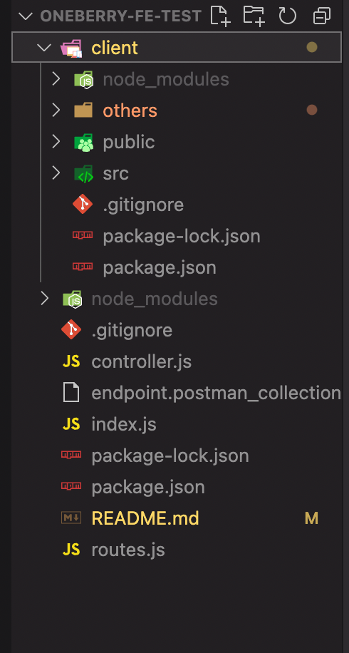

# Welcome!

## Requirements

- [Click here ](client/others/Technical-Test-for-Frontend-and-Backend-Developer.pdf) to view requirement.

## Approach

User select the parameters from the provided dropdown selector. The result are retrieved by filtering from the main data which were fetched from the provided endpoint during initial loading.

The result are rendered in a table format which list out their respective parameters.


## API List

Endpoint for retrieving list of `suppliers` - [https://morning-hollows-07984.herokuapp.com/api/gov-procurement/suppliers]

Endpoint for retrieving list of `procurements` - [https://morning-hollows-07984.herokuapp.com/api/gov-procurement/procurements]

Endpoint for retrieving list of `agencies` - [https://morning-hollows-07984.herokuapp.com/api/gov-procurement/agencies]

The APIs' are being called simultaneously on initial app loading via proxy server. Due to significant size of the of the response, the response are cached for 30 mins upon the first call. This facilitates faster reloading and refreshing of the app on subsequent request.

## Technologies used

- ReactJs
- Bootstrap
- NodeJs
- Heroku

## Live Application URL

The Application is deployed on heroku

- [Click here ](https://oneberry-fe-test.herokuapp.com/) to see the application

## Cloning and Running the Application in local

Clone down this repository. You will need `node` and `npm` installed globally on your machine.

Go into the project `ROOT` folder and type the following command to install all npm packages for the `PROXY SERVER`

```bash
npm install
```

From the `ROOT` folder, go into the `CLIENT` folder and type the following command to install all npm packages for the `REACT APP`

```bash
npm install
```

[](client/others/File-structure.png)

In order to run the application, the `SERVER` and `FRONTEND` need to be running together

To Start `SERVER`, in the `ROOT` folder, type:

```bash
npm start
```

To Start `FRONDEND`, open another `TERMINAL` window and go to the `CLIENT` folder,type:

```bash
npm start
```

[](client/others/Terminal.png)

### To Visit App:

Simply open any browser and run the URL: [http://localhost:3000/]
